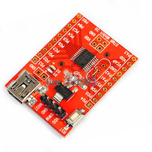

#STM8S Example Projects With [SDCC](http://sdcc.sourceforge.net/)
This repository is a collection of simple projects for STM8S003F3 to help you get started with this series of small, cheap but capable MCU's.

#Hardware
The examples in this repository are tested with a generic STM8S003F3P6 in TSSOP20 package. There is no reason they do not work on other packages.

For compatibility with other STM8X (e.g. L) series of MCU's make sure the registers in the "include/stm8s.h" are compatible with your own MCU. Just make a copy of this file and apply changes according to the datasheet of the chip you have at hand.

For tutorial on programming these examples on your MCU, please check the [guide to flashing stm8 on linux](http://embedonix.com/articles/linux/setting-up-development-and-programming-for-stm8-on-linux/).

#Folder Structure
-<b>examples</b> 
--<b>include</b> 
---<b>stm8s003.h</b>&nbsp;&nbsp;&nbsp;&nbsp;definition of the registers and option bits based on the STM8S003F3 datasheet. 
---<b>Makefile</b>&nbsp;&nbsp;&nbsp;&nbsp;GNU Makefile. do 'make' to compile and 'make flash' to upload the binary file to target MCU 
--<b>blink</b> 
---<b>blink.c</b>&nbsp;&nbsp;&nbsp;&nbsp;example for GPIO, seting pins HIGH, LOW or toggle them. 
---<b>Makefile</b>&nbsp;&nbsp;&nbsp;&nbsp;GNU Makefile. do 'make' to compile and 'make flash' to upload the binary file to target MCU 
--<b>uart</b> 
---<b>Makefile</b>&nbsp;&nbsp;&nbsp;&nbsp;GNU Makefile. do 'make' to compile and 'make flash' to upload the binary file to target MCU 
---<b>uart.c</b>&nbsp;&nbsp;&nbsp;&nbsp;example for sending and receiving string from/to the UART1 peropheral. 
-<b>resources</b>&nbsp;&nbsp;&nbsp;&nbsp;images for the repository which has nothing to do with actual examples.

#How to use?
Just go inside the 'examples' folder and see the source code for each example. Use the Make file to compile and flash the example on your own chip.

#What's coming next?
This is an ongoing project. I will try to add more examples, e.g. Timers, interruprs, SPI and I2C.

#What can you do?
If you have nice examples and projects, please contribiute to this repository.

#Donations
Your donations will make further development much faster! If you are interested to donate to EMBEDONIX (any amount even 1$ is welcome!) please visit [EMBEDONIX.COM](http://www.embedonix.com) and click on the paypal donate button!