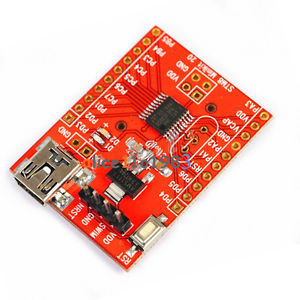

# STM8S003F3 Examples With SDCC

This repository is a small collection of STM8S003F3 example projects from Embedonix. It is focused on simple C examples, direct register use, and the SDCC based workflow that was used in the original tutorials.

The project started around the 2015 Embedonix STM8 tutorial series. The Git history in this repository starts in 2016. It is now being revived as a preserved and maintained STM8 example collection, not as a new framework.

## What This Repository Is For

This repository is useful if you want to:

- learn basic STM8S bare metal programming
- see small GPIO, input, LED sequence, and UART examples
- use SDCC and simple Makefiles instead of a large vendor framework
- understand older STM8 educational material from Embedonix

## What This Repository Is Not For

This repository is not meant to compete with STM32, Arduino, STM8Cube style projects, or modern HAL frameworks. It is also not a complete driver library. The examples are intentionally small and should be read as teaching material and historical STM8 reference code.

## Hardware



The original examples were written for a generic STM8S003F3P6 board in the TSSOP20 package. The register header currently targets STM8S003 style devices through `include/stm8s003.h`.

Other STM8S packages or parts may work if the same peripherals and pins are available, but this should be checked against the device datasheet. STM8L and other STM8 families may need different register definitions.

## Examples

| Folder | What it demonstrates | Main pins and assumptions | Current status |
| --- | --- | --- | --- |
| `examples/blink` | GPIO output and delay loop | LED on PD3 | Not recently verified |
| `examples/inputpooling` | GPIO input polling and output control | Button on PD4, LED on PD3 | Not recently verified |
| `examples/leddance` | GPIO output patterns with a small LED sequence helper | LEDs on PC3 to PC7 and PD1 to PD3 | Not recently verified |
| `examples/uart` | USART1 transmit at 9600 baud | USART1, 16 MHz clock assumption | Not recently verified |

The current revival work has not yet rebuilt or flashed these examples. Historical README text said the examples were tested on a generic STM8S003F3P6 board, but that should be treated as historical status until the examples are rebuilt and flashed again.

## Toolchain

The visible build flow is based on:

- SDCC with `-mstm8`
- per-example Makefiles
- POSIX style shell commands such as `mkdir -p` and `rm -rf`
- `packihx` for the UART example
- `stm8flash` with ST-Link v2 for flashing

Typical use, once the tools are installed:

```sh
cd examples/blink
make
make flash
```

These commands are the intended flow from the existing Makefiles. They still need to be verified as part of the revival.

More notes are in `docs/toolchain-notes.md` and `docs/build-system-notes.md`.

## Repository Layout

| Path | Purpose |
| --- | --- |
| `examples` | Example applications |
| `include` | Register definitions and helper headers |
| `src` | Shared helper implementations |
| `docs` | Doxygen configuration and project notes |
| `resources` | Images used by the README and generated docs |

## Links

- [Embedonix STM8 articles](https://www.embedonix.com/tag/stm8/)
- [Setting up development and programming for STM8 on Linux](https://www.embedonix.com/articles/linux/setting-up-development-and-programming-for-stm8-on-linux/)
- [Getting started with STM8 Development, Part 1, Blinking a LED](https://www.embedonix.com/articles/embedded-projects/getting-started-with-stm8-development-part-1-blinking-a-led/)
- [Getting started with STM8 Development, Part 2, Input handling](https://www.embedonix.com/articles/embedded-projects/getting-started-with-stm8-development-part-2-input-handling/)
- [STM8 Development Tutorial playlist](https://www.youtube.com/playlist?list=PLi34N3psiJFKmuYrmJ_CJot478Im7dFbF)
- Revival article: planned

## Legacy Notes

The old README described this as an ongoing project and mentioned future examples such as timers, interrupts, SPI, and I2C. Those are still useful directions, but new examples should be added only after the existing ones are documented and the build flow is verified.

The original README also invited contributions and support through Embedonix. Contributions are still welcome, especially practical fixes, tested build notes, and small examples that match the style of the existing code.

## License Status

Some Makefile comments mention GNU LGPL, but this repository does not currently include a root license file. The license should be clarified before code is reused outside normal example and study use.
